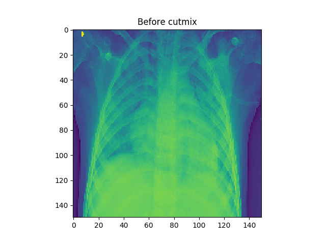
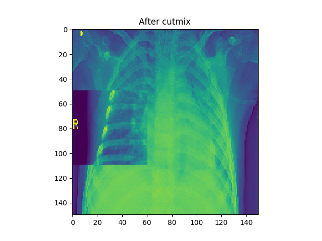
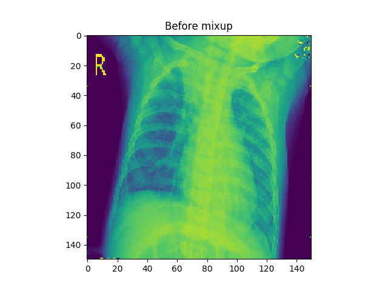
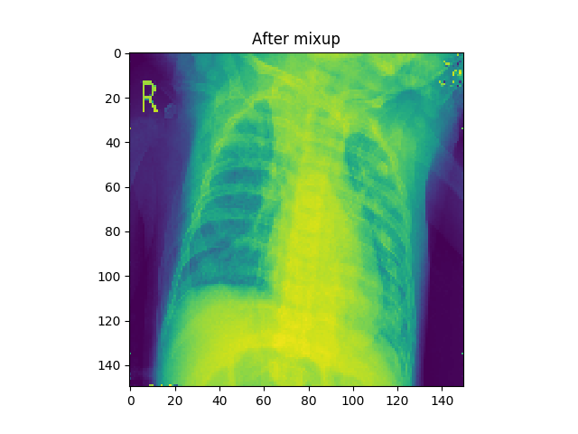
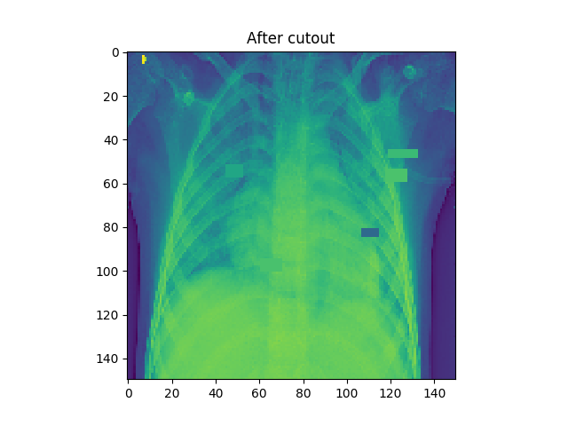

# Pneumonia Detection
This project explores diagnosing pneumonia through chest x-ray images with the help of deep 
learning (TensorFlow & Keras) and various data augmentation methods. The dataset used for this project is 
part of a Kaggle challenge and can be found [here](https://www.kaggle.com/paultimothymooney/chest-xray-pneumonia).

## Neural Network
The neural network used is written in Keras and consists of three convolution blocks as well as a max pool layer for each one of them.
On the top there's a fully connected layer with 512 units which is activated using relu-activation. 
We also added Dropout layers to two of the convolution layers to reduce over fitting due to the scarcity of data.

## Preprocessing
The images in the dataset were scaled to 150x150 pixels and converted from RGB to grayscale
before they were fed to the model. 

## Data Augmentation
The data augmentation methods that were tested were Cutmix, Mixup and Cutout, as well 
as combinations of these. 

### Cutmix

[Link to paper](https://arxiv.org/abs/1905.04899)

### Mixup

[Link to paper](https://arxiv.org/abs/1710.09412)

### Cutout

[Link to paper](https://arxiv.org/abs/1708.04552)

  
